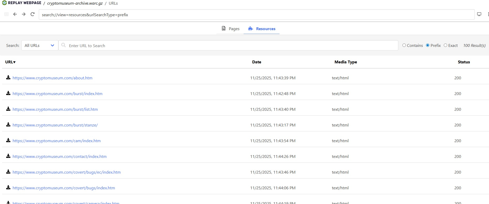
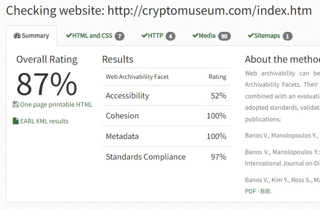

# Архив сайта Музея криптографии - Crypto Museum

«Crypto Museum» – сайт частного музея криптографии . Сайт давно не обновлялся, и сделан с использованиям старых способой верстки веб страниц.

## wpull

**Описание раздела**

В разделе содержится информация о результатах сбора архива сайта при помощи скрипта массовой загрузки с использованием библиотеки Python **wpull**.

**Результаты**

В ходе работы удалось успешно сохранить сайт музея криптографии, что подтверждается при попытке открыть и просмотреть архив в сервисе [REPLAY WEBPAGE](https://replayweb.page/) (не прогружаются лишь отдельные ссылки, ведущие на внешние ресурсы, что вполне ожидаемо). 

**Характеристики архива:**
- Размер сжатого архива (.warc.gz): 2,090,113 байт (~2.0 MB)
- Общий объем содержимого сайта: 13,762,426 байт (~13.1 MB)
- Количество сохраненных записей: 168 

## ArchiveReady

**Описание раздела**

В разделе содержатся данные, полученные в ходе подсчёта показателей архивируемости сайта по методике **CLEAR** с помощью сервиса **ArchiveReady**, а также анализ полученных результатов.

**Результаты**

Несмотря на успешный эксперимент по загрузке сайта при помощи **wpull**, он получил достойный индекс архивируемости – 87%, обусловленный средними и высокими показателями всех аспектов: доступности (Accessibility), целостности (Cohesion), метаданных (Metadata) и соответствия стандартам (Standards compliance).  Изучение подробных результатов показало следующее:
1. У сайта низкий показатель доступности, который связан с неудачно организованным кодом, и отсутствием sitemap, который упростил бы архивацию за счет готового представления структуры сайта, и наличием команд disallow в robots.txt.
2. На показатель соответствия стандартам повлияли некорректные html- и css-файлы.

## metawarc

**Описание раздела**

В разделе содержатся результаты анализа метаданных содержимого warc-файлов с помощью утилиты командной строки **metawarc** версии 1.1.1. В работе использовались следующие команды:
 1. **analyze** - анализ по MIME-типам и расширениям файлов
 2. **metadata** - извлечение метаданных из офисных документов
 3. **export** - экспорт HTTP-заголовков

**Результаты**

#### Общая информация об архиве
- **Размер архива (.warc.gz)**: 2,090,113 байт (~2.0 MB)
- **Количество записей**: 168
- **Общий размер контента**: 13,762,426 байт (~13.1 MB)

#### Анализ по MIME-типам
`python -m metawarc analyze cryptomuseum-archive.warc.gz -m mimes`

| MIME-тип | Количество файлов | Размер (байт) | Доля (%) |
|----------|-------------------|---------------|----------|
| text/html | 168 | 13,762,426 | 100.0 |
| **Всего** | **168** | **13,762,426** | **100.0** |

Архив содержит исключительно HTML-контент, что характерно для статических сайтов с простой структурой.

#### Анализ по расширениям файлов
`python -m metawarc analyze cryptomuseum-archive.warc.gz -m exts`

| Расширение | Количество файлов | Размер (байт) | Доля (%) |
|------------|-------------------|---------------|----------|
| htm | 64 | 7,796,061 | 56.65 |
| (без расширения) | 104 | 5,966,365 | 43.35 |
| **Всего** | **168** | **13,762,426** | **100.0** |

Большая часть файлов имеет расширение `.htm`, что соответствует структуре сайта. Остальные файлы не имеют расширения, что может быть связано с редиректами или динамическими URL.

#### HTTP-заголовки
`python -m metawarc export cryptomuseum-archive.warc.gz -t headers -o cryptomuseum_headers.txt`

**Характеристики сервера:**
- **Сервер**: LiteSpeed
- **Кодировка**: UTF-8
- **HTTP-статусы**: 
  - 200 (OK) - успешные запросы
  - 301 (Moved Permanently) - редиректы

**Примеры URL из архива:**
- https://www.cryptomuseum.com/index.htm
- https://www.cryptomuseum.com/covert/cases/ikar/
- https://www.cryptomuseum.com/spy/list.htm
- https://www.cryptomuseum.com/crypto/enigma/mzl/

#### Метаданные документов
`python -m metawarc metadata cryptomuseum-archive.warc.gz -o cryptomuseum_metadata.txt`

Извлечение метаданных из офисных документов (doc, xls, ppt, docx, xlsx, pptx): **не найдено документов**. Это подтверждает, что архив содержит только HTML-страницы без вложенных документов.