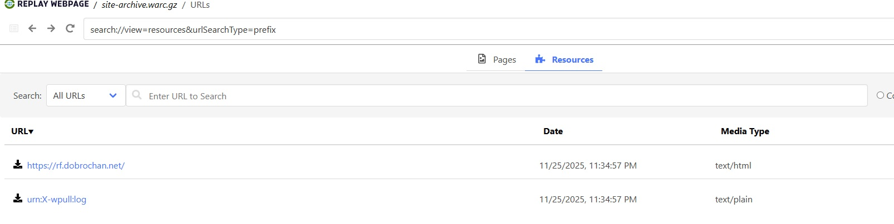
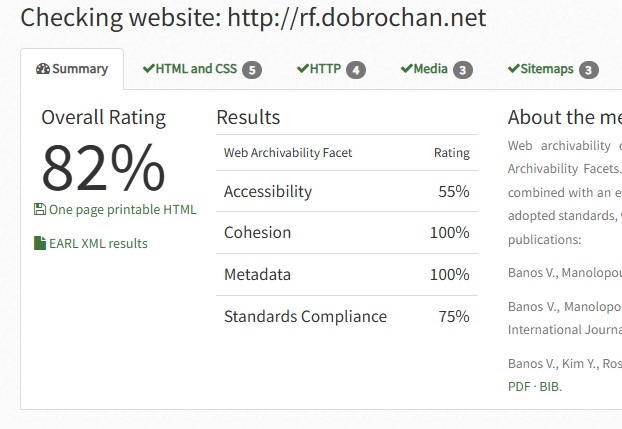

# Архив сайта форума Доброчан

«Доброчан» (rf.dobrochan.net) - форум, представляющий собой платформу для общения пользователей. Сайт использует современные веб-технологии и защищен сервисом Cloudflare.

## wpull

**Описание раздела**

В разделе содержится информация о результатах сбора архива сайта при помощи скрипта массовой загрузки с использованием библиотеки Python **wpull**.

**Результаты**

В ходе работы удалось успешно сохранить главную страницу форума, что подтверждается при попытке открыть и просмотреть архив в сервисе [REPLAY WEBPAGE](https://replayweb.page/).

**Характеристики архива:**
- Размер сжатого архива (.warc.gz): 4,179 байт (~4.1 KB)
- Общий объем содержимого сайта: 2,042 байт (~2.0 KB)
- Количество сохраненных записей: 1

Архив содержит только главную страницу форума, что связано с ограничениями доступа или особенностями структуры сайта.

## ArchiveReady

**Описание раздела**

В разделе содержатся данные, полученные в ходе подсчёта показателей архивируемости сайта по методике **CLEAR** с помощью сервиса **ArchiveReady**, а также анализ полученных результатов.

**Результаты**

Индекс архивируемости – 82% вполне хороший, но показатели доступности (Accessibility) и соответствия стандартам (Standards compliance) страдают по тем же причинам, что и cryptomuseum.

## metawarc

**Описание раздела**

В разделе содержатся результаты анализа метаданных содержимого warc-файлов с помощью утилиты командной строки **metawarc** версии 1.1.1. В работе использовались следующие команды:
 1. **analyze** - анализ по MIME-типам и расширениям файлов
 2. **metadata** - извлечение метаданных из офисных документов
 3. **export** - экспорт HTTP-заголовков

**Результаты**

#### Общая информация об архиве
- **Размер архива (.warc.gz)**: 4,179 байт (~4.1 KB)
- **Количество записей**: 1
- **Общий размер контента**: 2,042 байт (~2.0 KB)

#### Анализ по MIME-типам
`python -m metawarc analyze site-archive.warc.gz -m mimes`

| MIME-тип | Количество файлов | Размер (байт) | Доля (%) |
|----------|-------------------|---------------|----------|
| text/html | 1 | 2,042 | 100.0 |
| **Всего** | **1** | **2,042** | **100.0** |

Архив содержит только одну HTML-страницу (главная страница форума).

#### Анализ по расширениям файлов
`python -m metawarc analyze site-archive.warc.gz -m exts`

| Расширение | Количество файлов | Размер (байт) | Доля (%) |
|------------|-------------------|---------------|----------|
| (без расширения) | 1 | 2,042 | 100.0 |
| **Всего** | **1** | **2,042** | **100.0** |

Файл не имеет расширения, что характерно для главной страницы сайта.

#### HTTP-заголовки
`python -m metawarc export site-archive.warc.gz -t headers -o dobrochan_headers.txt`

**Характеристики сервера:**
- **Сервер**: cloudflare
- **Дата последнего изменения**: Sun, 02 Apr 2023 18:58:51 GMT
- **URL**: https://rf.dobrochan.net/
- **HTTP-статус**: 200 (OK) - успешный запрос

**Особенности:**
- Сайт защищен сервисом Cloudflare
- Используется кэширование (Cache-Control: max-age=0, must-revalidate)
- Поддержка HTTP/3 (alt-svc)

#### Метаданные документов
`python -m metawarc metadata site-archive.warc.gz -o dobrochan_metadata.txt`

Извлечение метаданных из офисных документов (doc, xls, ppt, docx, xlsx, pptx): **не найдено документов**. Архив содержит только HTML-страницу без вложенных документов.

