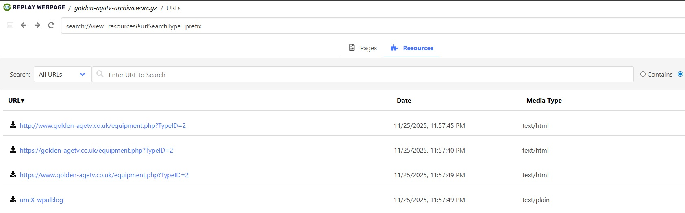
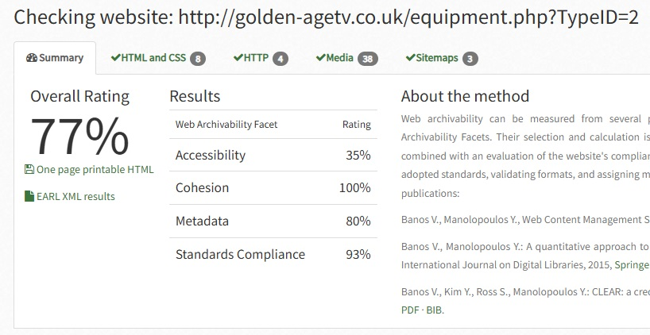

# Архив сайта справочника ТВ оборудования Golden Age TV

«Справочник ТВ оборудования Golden Age TV© LLP» (golden-agetv.co.uk) – сайт, содержащий информацию о телевизионном оборудовании. Сайт использует PHP-скрипты и имеет систему редиректов между версиями с http и https протоколами.

## wpull

**Описание раздела**

В разделе содержится информация о результатах сбора архива сайта при помощи скрипта массовой загрузки с использованием библиотеки Python **wpull**.

**Результаты**

В ходе работы удалось успешно сохранить страницы сайта, что подтверждается при попытке открыть и просмотреть архив в сервисе [REPLAY WEBPAGE](https://replayweb.page/).

**Характеристики архива:**
- Размер сжатого архива (.warc.gz): 11,507 байт (~11.2 KB)
- Общий объем содержимого сайта: 44,986 байт (~43.9 KB)
- Количество сохраненных записей: 3

Архив содержит ограниченное количество страниц, что может быть связано с особенностями структуры сайта или ограничениями доступа.

## ArchiveReady

**Описание раздела**

В разделе содержатся данные, полученные в ходе подсчёта показателей архивируемости сайта по методике **CLEAR** с помощью сервиса **ArchiveReady**, а также анализ полученных результатов.

**Результаты**

## metawarc

**Описание раздела**

В разделе содержатся результаты анализа метаданных содержимого warc-файлов с помощью утилиты командной строки **metawarc** версии 1.1.1. В работе использовались следующие команды:
 1. **analyze** - анализ по MIME-типам и расширениям файлов
 2. **metadata** - извлечение метаданных из офисных документов
 3. **export** - экспорт HTTP-заголовков

**Результаты**

#### Общая информация об архиве
- **Размер архива (.warc.gz)**: 11,507 байт (~11.2 KB)
- **Количество записей**: 3
- **Общий размер контента**: 44,986 байт (~43.9 KB)

#### Анализ по MIME-типам
`python -m metawarc analyze golden-agetv-archive.warc.gz -m mimes`

| MIME-тип | Количество файлов | Размер (байт) | Доля (%) |
|----------|-------------------|---------------|----------|
| text/html | 3 | 44,986 | 100.0 |
| **Всего** | **3** | **44,986** | **100.0** |

Архив содержит только HTML-контент, сгенерированный PHP-скриптами.

#### Анализ по расширениям файлов
`python -m metawarc analyze golden-agetv-archive.warc.gz -m exts`

| Расширение | Количество файлов | Размер (байт) | Доля (%) |
|------------|-------------------|---------------|----------|
| php | 3 | 44,986 | 100.0 |
| **Всего** | **3** | **44,986** | **100.0** |

Все файлы имеют расширение `.php`, что указывает на использование PHP-скриптов для генерации контента.

#### HTTP-заголовки
`python -m metawarc export golden-agetv-archive.warc.gz -t headers -o golden-agetv_headers.txt`

**Характеристики сервера:**
- **Сервер**: Apache/2.4.65 (Debian)
- **Кодировка**: iso-8859-1, UTF-8
- **HTTP-статусы**: 
  - 200 (OK) - успешные запросы
  - 301 (Moved Permanently) - редиректы

**URL из архива:**
- https://golden-agetv.co.uk/equipment.php?TypeID=2
- http://www.golden-agetv.co.uk/equipment.php?TypeID=2
- https://www.golden-agetv.co.uk/equipment.php?TypeID=2

**Особенности:**
- Сайт использует систему редиректов: https → http → https
- Используется кэширование (Cache-Control: max-age=3600)
- Поддержка различных кодировок (iso-8859-1 и UTF-8)

#### Метаданные документов
`python -m metawarc metadata golden-agetv-archive.warc.gz -o golden-agetv_metadata.txt`

Извлечение метаданных из офисных документов (doc, xls, ppt, docx, xlsx, pptx): **не найдено документов**. Архив содержит только HTML-страницы, сгенерированные PHP-скриптами, без вложенных документов.

